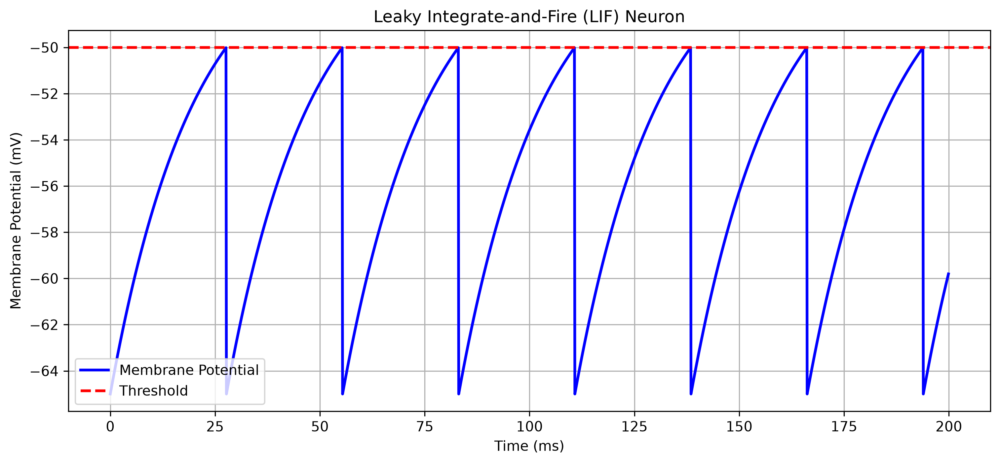
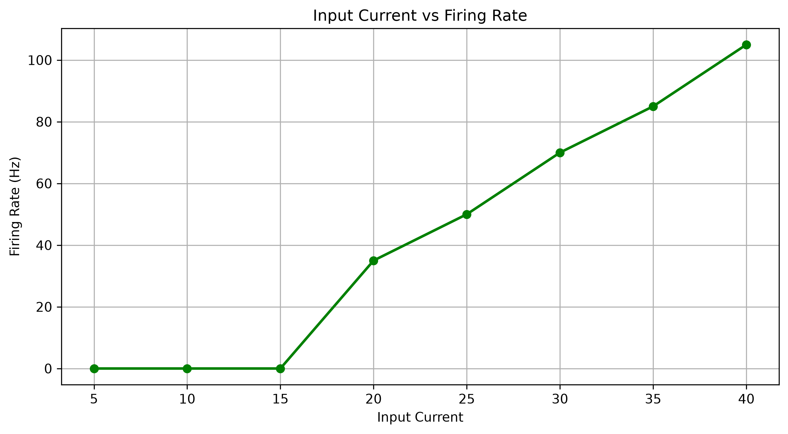

# Neuromorphic VLSI Architecture using the Leaky Integrate-and-Fire (LIF) Neuron Model

A Python-based implementation and analysis of the Leaky Integrate-and-Fire (LIF) neuron model for studying neuromorphic computing and spiking neural networks.

## Project Overview

Neuromorphic computing aims to mimic the computational principles of the human brain using networks of artificial neurons.

This project implements the **Leaky Integrate-and-Fire (LIF)** neuron model in Python. The notebook demonstrates:

- Mathematical modelling of a biological neuron
- Numerical simulation using the Forward Euler method
- Spike generation through threshold detection
- Membrane potential visualization
- Spike train visualization
- Analysis of firing rate with varying input current

The project serves as an introduction to neuromorphic engineering and provides a foundation for future FPGA or ASIC implementations.

## Repository Structure

```text
Neuromorphic-LIF-Simulation/
│
├── notebooks/
│   └── lif_simulation.ipynb
│
├── results/
│   ├── lif_membrane_potential.png
│   └── firing_rate_vs_current.png
│
├── docs/
│
├── requirements.txt
│
├── LICENSE
│
└── README.md
```

## Features

- Leaky Integrate-and-Fire neuron implementation
- Forward Euler numerical simulation
- Membrane potential visualization
- Spike train visualization
- Input current parameter sweep
- Firing rate analysis
- Jupyter Notebook implementation

## Mathematical Model

The membrane potential follows the differential equation:

```text
τ(dV/dt) = -(V − Vrest) + RI
```

where

- **V** : Membrane potential
- **τ** : Membrane time constant
- **R** : Membrane resistance
- **I** : Injected current

Whenever

```text
V ≥ Vthreshold
```

the neuron generates a spike and immediately resets to

```text
V = Vreset
```

## Future Work

Possible extensions of this project include:

- Adaptive Leaky Integrate-and-Fire (ALIF) neurons
- Multi-neuron Spiking Neural Networks (SNNs)
- Synaptic plasticity using Spike-Timing-Dependent Plasticity (STDP)
- FPGA implementation using Verilog
- ASIC implementation for neuromorphic processors
- Integration with machine learning frameworks

## Technologies Used

- Python 3
- NumPy
- Matplotlib
- Jupyter Notebook
- Git
- GitHub

## Installation

Clone the repository

```bash
git clone https://github.com/akshajsaigandi-ux/Neuromorphic-LIF-Simulation.git
```

Install dependencies

```bash
pip install -r requirements.txt
```

Launch Jupyter Notebook

```bash
jupyter notebook
```

## Usage

Open

```text
notebooks/lif_simulation.ipynb
```

Run all notebook cells.

The notebook will

- simulate the neuron
- generate spikes
- plot membrane potential
- plot spike train
- perform parameter analysis

## References

1. Wulfram Gerstner and Werner M. Kistler, *Spiking Neuron Models*.

2. Wolfgang Maass, *Networks of Spiking Neurons*.

3. C. Mead, *Neuromorphic Electronic Systems*, Proceedings of the IEEE.

4. Eugene M. Izhikevich, *Dynamical Systems in Neuroscience*.

## Results

### Membrane Potential

The membrane potential increases gradually until it reaches the firing threshold. Once the threshold is exceeded, the neuron emits a spike and the membrane potential resets to the resting potential.

<p align="center">

</p>

---

### Input Current vs Firing Rate

The firing rate increases with increasing input current, demonstrating the characteristic response of the Leaky Integrate-and-Fire neuron.

<p align="center">

</p>

